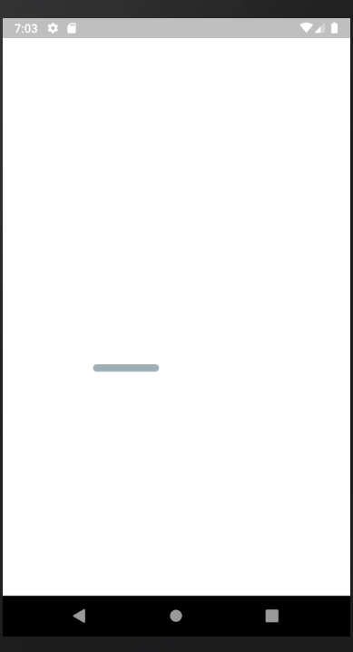

# Clean-House
## Plataforma que conecta clientes a uma rede de profissionais domésticos 

  

### O projeto tem como objetivo construir uma plataforma em que usuários peçam serviços domésticos, ou realize serviços.

## Usuário cliente solicita serviços, escolhendo residência desejada, e o profissional (que escolheu trabalhar na cidade da residência) disponivel para aquele endereço

  

## Usuários profissinais recebem propostas de serviços e podem aceitar ou recusar 

  

## A plataforma conecta os dois usuarios, sem vínculos empregatícios
### o poder de esolha fica para os usuários, tanto na escolha de trabalhar ou não em determinado local ou para determinado cliente, como qual profissional deseja para trabalhar em sua residência.

# Tecnologias 
## sptring boot back-end 
## reactjs  front-end 
## flutter  mobile
## containers aws para hospedagens (banco, api, web)
## firebase (api do google) para armazenamento de arquivos
### entre outras tecnologias ou consumo de api

desenvolvido para TCC

